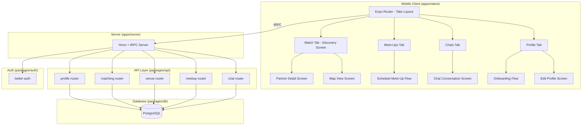
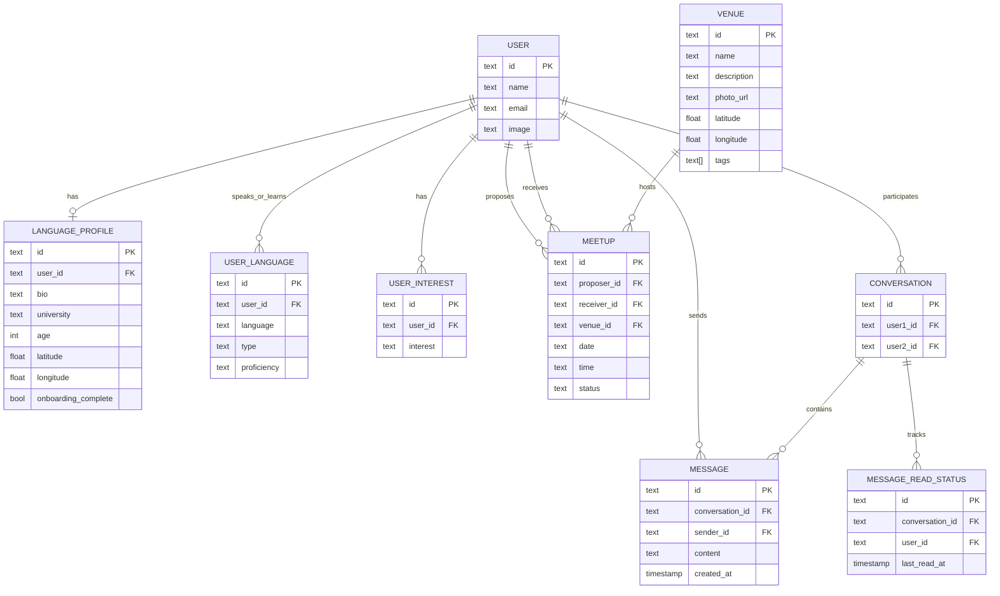

# Design Document: Sip&Speak

## Overview

Sip&Speak is a language exchange matchmaking feature for university students, built on top of the existing turborepo monorepo. It adds language profile management, partner discovery with scoring, venue browsing, meet-up scheduling, and contextual chat to the Expo/React Native mobile app (`apps/native`), backed by tRPC procedures in `packages/api` and Drizzle ORM schemas in `packages/db`.

The feature is primarily mobile-focused. The web app (`apps/web`) is not in scope for this phase — all new screens target the native Expo Router layout. The backend is shared via the existing Hono server (`apps/server`) and tRPC layer.

### Key Design Decisions

1. **tRPC for all API calls** — Consistent with the existing architecture. No REST endpoints added.
2. **Drizzle ORM schemas in `packages/db`** — All new tables live alongside the existing auth schema.
3. **Expo Router tabs for navigation** — The existing `(drawer)/(tabs)` layout is restructured to the four Sip&Speak tabs: Match, Meet-Ups, Chats, Profile.
4. **No real-time WebSocket for v1** — Chat uses polling via tRPC queries. Real-time can be layered in later.
5. **Matching is server-side** — The Matching_Engine runs scoring logic on the server, returning pre-ranked results to the client.
6. **Venue data is seed-based for v1** — Venues are seeded into the database by admins/scripts. No user-generated venue creation.

## Architecture



### Component Responsibilities

- **Profile Router** — CRUD for language profiles, onboarding status tracking, interest management.
- **Matching Router** — Scoring algorithm, filtered discovery queries, partner ranking.
- **Venue Router** — Venue listing, filtering by tags, proximity sorting, map data.
- **MeetUp Router** — Propose/accept/decline meet-ups, conflict detection, status management.
- **Chat Router** — Message send/receive, conversation listing, unread counts, message history.

## Components and Interfaces

### tRPC Router Definitions

#### Profile Router (`packages/api/src/routers/profile.ts`)

```typescript
profileRouter = router({
  // Get current user's language profile
  getMyProfile: protectedProcedure.query(),

  // Create or update language profile (onboarding + edit)
  upsertProfile: protectedProcedure
    .input(z.object({
      bio: z.string().max(500).optional(),
      university: z.string().optional(),
      age: z.number().int().min(16).max(99).optional(),
      latitude: z.number().optional(),
      longitude: z.number().optional(),
      spokenLanguages: z.array(z.object({
        language: z.string(),
        proficiency: z.enum(["beginner", "intermediate", "advanced", "native"]),
      })).min(1),
      learningLanguages: z.array(z.object({
        language: z.string(),
      })).min(1),
      interests: z.array(z.enum([
        "modern_art", "tech_coding", "jazz_music",
        "culinary_arts", "sustainability", "cinephile", "cosmology"
      ])),
    }))
    .mutation(),

  // Save partial profile (skip for now)
  savePartialProfile: protectedProcedure
    .input(z.object({ /* same fields but all optional */ }))
    .mutation(),

  // Check if onboarding is complete
  getOnboardingStatus: protectedProcedure.query(),
})
```

#### Matching Router (`packages/api/src/routers/matching.ts`)

```typescript
matchingRouter = router({
  // Get ranked list of potential partners
  discover: protectedProcedure
    .input(z.object({
      filter: z.enum(["near_you", "language"]).optional(),
      filterLanguage: z.string().optional(),
      cursor: z.string().optional(),
      limit: z.number().int().min(1).max(50).default(20),
    }))
    .query(),

  // Get detailed partner profile
  getPartnerProfile: protectedProcedure
    .input(z.object({ userId: z.string() }))
    .query(),
})
```

#### Venue Router (`packages/api/src/routers/venue.ts`)

```typescript
venueRouter = router({
  // List venues sorted by proximity
  list: protectedProcedure
    .input(z.object({
      latitude: z.number(),
      longitude: z.number(),
      tags: z.array(z.enum(["wifi", "quiet_zone", "campus", "outdoor", "vibrant"])).optional(),
      cursor: z.string().optional(),
      limit: z.number().int().min(1).max(50).default(20),
    }))
    .query(),

  // Get all venues for map view
  mapData: protectedProcedure
    .input(z.object({
      latitude: z.number(),
      longitude: z.number(),
      radiusKm: z.number().default(5),
    }))
    .query(),
})
```

#### MeetUp Router (`packages/api/src/routers/meetup.ts`)

```typescript
meetupRouter = router({
  // Propose a meet-up
  propose: protectedProcedure
    .input(z.object({
      partnerId: z.string(),
      venueId: z.string(),
      date: z.string(), // ISO date
      time: z.string(), // HH:mm
    }))
    .mutation(),

  // Respond to a meet-up proposal
  respond: protectedProcedure
    .input(z.object({
      meetupId: z.string(),
      action: z.enum(["accept", "decline"]),
    }))
    .mutation(),

  // List user's meet-ups (upcoming, pending, past)
  list: protectedProcedure
    .input(z.object({
      status: z.enum(["pending", "confirmed", "declined", "all"]).default("all"),
    }))
    .query(),

  // Get available time slots for a date
  getAvailableSlots: protectedProcedure
    .input(z.object({
      partnerId: z.string(),
      date: z.string(),
    }))
    .query(),

  // Get pending meet-up count (for badge)
  pendingCount: protectedProcedure.query(),
})
```

#### Chat Router (`packages/api/src/routers/chat.ts`)

```typescript
chatRouter = router({
  // List conversations with last message preview
  listConversations: protectedProcedure.query(),

  // Get messages for a conversation
  getMessages: protectedProcedure
    .input(z.object({
      conversationId: z.string(),
      cursor: z.string().optional(),
      limit: z.number().int().min(1).max(100).default(50),
    }))
    .query(),

  // Send a message
  sendMessage: protectedProcedure
    .input(z.object({
      conversationId: z.string(),
      content: z.string().min(1).max(2000),
    }))
    .mutation(),

  // Start a new conversation (Say Hi)
  startConversation: protectedProcedure
    .input(z.object({
      partnerId: z.string(),
      greeting: z.string().min(1).max(500).optional(),
    }))
    .mutation(),

  // Get unread conversation count (for badge)
  unreadCount: protectedProcedure.query(),

  // Mark conversation as read
  markRead: protectedProcedure
    .input(z.object({ conversationId: z.string() }))
    .mutation(),
})
```

### Native App Screens (apps/native)

#### Tab Layout Restructure

The existing `(drawer)/(tabs)/_layout.tsx` is updated to four tabs:

| Tab | Route | Icon | Screen |
|-----|-------|------|--------|
| MATCH | `(tabs)/index` | `people-outline` | Discovery Screen |
| MEET-UPS | `(tabs)/meetups` | `calendar-outline` | Meet-Ups List |
| CHATS | `(tabs)/chats` | `chatbubbles-outline` | Conversations List |
| PROFILE | `(tabs)/profile` | `person-outline` | Profile / Settings |

#### Additional Screens (Stack routes)

- `partner/[id]` — Partner detail view
- `schedule/[partnerId]` — Meet-up scheduling flow (venue → date → time → confirm)
- `chat/[conversationId]` — Chat conversation view
- `onboarding` — Step-by-step profile setup (modal or stack)
- `map` — Full map view of venues

### Matching Algorithm

The scoring function runs server-side and produces a composite score:

```
score = (languageScore * 0.5) + (interestScore * 0.3) + (proximityScore * 0.2)
```

- **languageScore (0-1)**: 1.0 if partner speaks a language user wants to learn AND partner wants to learn a language user speaks natively. 0.5 for partial matches. 0 for no complementarity.
- **interestScore (0-1)**: `sharedInterests.length / max(userInterests.length, partnerInterests.length)`
- **proximityScore (0-1)**: Inverse distance normalized. `1 - min(distance / maxRadius, 1)`

## Data Models

### Database Schema (packages/db/src/schema/)

All new tables reference the existing `user` table from `auth.ts`.

#### `language_profile` table

```typescript
export const languageProfile = pgTable("language_profile", {
  id: text("id").primaryKey().$defaultFn(() => crypto.randomUUID()),
  userId: text("user_id").notNull().unique()
    .references(() => user.id, { onDelete: "cascade" }),
  bio: text("bio"),
  university: text("university"),
  age: integer("age"),
  latitude: doublePrecision("latitude"),
  longitude: doublePrecision("longitude"),
  onboardingComplete: boolean("onboarding_complete").default(false).notNull(),
  createdAt: timestamp("created_at").defaultNow().notNull(),
  updatedAt: timestamp("updated_at").defaultNow()
    .$onUpdate(() => new Date()).notNull(),
});
```

#### `user_language` table

```typescript
export const userLanguage = pgTable("user_language", {
  id: text("id").primaryKey().$defaultFn(() => crypto.randomUUID()),
  userId: text("user_id").notNull()
    .references(() => user.id, { onDelete: "cascade" }),
  language: text("language").notNull(),
  type: text("type", { enum: ["spoken", "learning"] }).notNull(),
  proficiency: text("proficiency", {
    enum: ["beginner", "intermediate", "advanced", "native"]
  }),
}, (table) => [
  index("user_language_userId_idx").on(table.userId),
]);
```

#### `user_interest` table

```typescript
export const userInterest = pgTable("user_interest", {
  id: text("id").primaryKey().$defaultFn(() => crypto.randomUUID()),
  userId: text("user_id").notNull()
    .references(() => user.id, { onDelete: "cascade" }),
  interest: text("interest", {
    enum: [
      "modern_art", "tech_coding", "jazz_music",
      "culinary_arts", "sustainability", "cinephile", "cosmology"
    ]
  }).notNull(),
}, (table) => [
  index("user_interest_userId_idx").on(table.userId),
]);
```

#### `venue` table

```typescript
export const venue = pgTable("venue", {
  id: text("id").primaryKey().$defaultFn(() => crypto.randomUUID()),
  name: text("name").notNull(),
  description: text("description"),
  photoUrl: text("photo_url"),
  latitude: doublePrecision("latitude").notNull(),
  longitude: doublePrecision("longitude").notNull(),
  tags: text("tags").array().notNull().default([]),
  createdAt: timestamp("created_at").defaultNow().notNull(),
});
```

#### `meetup` table

```typescript
export const meetup = pgTable("meetup", {
  id: text("id").primaryKey().$defaultFn(() => crypto.randomUUID()),
  proposerId: text("proposer_id").notNull()
    .references(() => user.id, { onDelete: "cascade" }),
  receiverId: text("receiver_id").notNull()
    .references(() => user.id, { onDelete: "cascade" }),
  venueId: text("venue_id").notNull()
    .references(() => venue.id),
  date: text("date").notNull(), // ISO date string YYYY-MM-DD
  time: text("time").notNull(), // HH:mm
  status: text("status", {
    enum: ["pending", "confirmed", "declined", "cancelled"]
  }).notNull().default("pending"),
  createdAt: timestamp("created_at").defaultNow().notNull(),
  updatedAt: timestamp("updated_at").defaultNow()
    .$onUpdate(() => new Date()).notNull(),
}, (table) => [
  index("meetup_proposerId_idx").on(table.proposerId),
  index("meetup_receiverId_idx").on(table.receiverId),
  index("meetup_date_idx").on(table.date),
]);
```

#### `conversation` table

```typescript
export const conversation = pgTable("conversation", {
  id: text("id").primaryKey().$defaultFn(() => crypto.randomUUID()),
  user1Id: text("user1_id").notNull()
    .references(() => user.id, { onDelete: "cascade" }),
  user2Id: text("user2_id").notNull()
    .references(() => user.id, { onDelete: "cascade" }),
  createdAt: timestamp("created_at").defaultNow().notNull(),
}, (table) => [
  index("conversation_user1_idx").on(table.user1Id),
  index("conversation_user2_idx").on(table.user2Id),
]);
```

#### `message` table

```typescript
export const message = pgTable("message", {
  id: text("id").primaryKey().$defaultFn(() => crypto.randomUUID()),
  conversationId: text("conversation_id").notNull()
    .references(() => conversation.id, { onDelete: "cascade" }),
  senderId: text("sender_id").notNull()
    .references(() => user.id, { onDelete: "cascade" }),
  content: text("content").notNull(),
  createdAt: timestamp("created_at").defaultNow().notNull(),
}, (table) => [
  index("message_conversationId_idx").on(table.conversationId),
  index("message_createdAt_idx").on(table.createdAt),
]);
```

#### `message_read_status` table

```typescript
export const messageReadStatus = pgTable("message_read_status", {
  id: text("id").primaryKey().$defaultFn(() => crypto.randomUUID()),
  conversationId: text("conversation_id").notNull()
    .references(() => conversation.id, { onDelete: "cascade" }),
  userId: text("user_id").notNull()
    .references(() => user.id, { onDelete: "cascade" }),
  lastReadAt: timestamp("last_read_at").defaultNow().notNull(),
}, (table) => [
  index("message_read_conversationId_userId_idx")
    .on(table.conversationId, table.userId),
]);
```

### Entity Relationship Diagram


